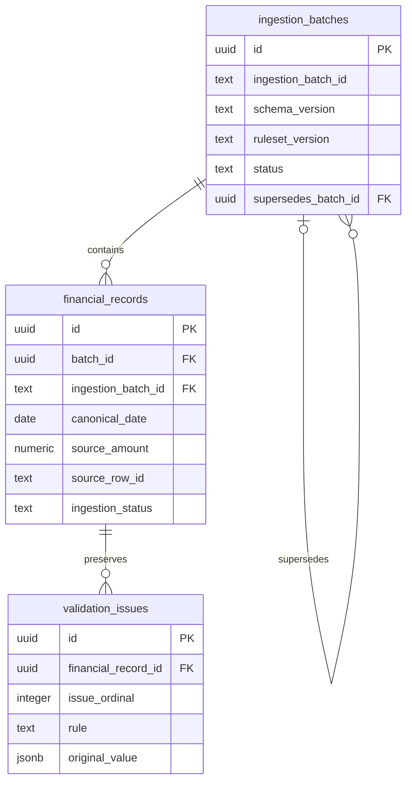

# Initial ingestion database foundation

## Canonical clean-schema column order

The clean SQL defines `source_file` directly as column 2 on all three tables:

- `ingestion_batches`: `id`, `source_file`, `ingestion_batch_id`, `schema_version`, `ruleset_version`, `status`, then the remaining foundation columns.
- `financial_records`: `id`, `source_file`, `batch_id`, `ingestion_batch_id`, then the remaining financial/lineage columns.
- `validation_issues`: `id`, `source_file`, `financial_record_id`, `issue_ordinal`, then the remaining evidence columns.

The existing-database additive upgrade remains unchanged and cannot reorder PostgreSQL columns. Clean and upgraded schemas retain equivalent behavior, but their physical order differs; verification compares named-column semantics while separately checking clean order. Original baseline fingerprints remain unchanged.

No existing-database reorder script is supplied. Rebuilding established tables solely for physical order risks existing data, object identities, dependent objects and privileges. Use explicit SELECT column lists when order matters. Hosted FYP A may contain data: it was not inspected or modified here, and its physical order is not claimed to have changed.


## Operational database workflow: Supabase SQL Editor only

Hosted FYP A may contain rows following separately performed source-file upgrade and Phase 2 processing. No hosted state was reverified here. Neither script was executed against hosted FYP A during this repository change.

1. Open Supabase Dashboard.
2. Select the correct project: FYP A.
3. Open SQL Editor.
4. Click New query.
5. Paste the complete appropriate SQL script from the table below.
6. Click Run only after separate hosted execution approval.
7. Verify `ingestion_batches`, `financial_records` and `validation_issues` in Table Editor.
8. Run the read-only metadata verification documented in the Phase 1 demo.

| Database state | SQL to paste |
| --- | --- |
| Empty database with no Phase 1 tables | `supabase/sql/phase1-clean-setup.sql` |
| Existing original Phase 1 tables, with or without rows | `supabase/sql/phase1-source-file-upgrade.sql` |

The clean script contains the complete current schema in one transaction, without seed/demo data. Never run it over existing Phase 1 tables. The upgrade adds only the missing source-file support and protections; it preserves existing schema/data and performs no fabricated backfill. It is a one-time upgrade: check the schema before applying it again. Do not run either script in fragments.

Operational SQL is version-controlled under `supabase/sql/`, but hosted execution is exclusively through SQL Editor. No migration CLI, VS Code SQL execution or terminal schema setup is part of this workflow. The original schema under `supabase/tests/fixtures/phase1-original-schema.sql` is immutable local test/history evidence, **never a setup method**. The unchanged synthetic seed is used by local verification, not included in either operational script.

Current schema: 3 tables, 58 columns, 11 indexes, 5 application triggers, RLS enabled, no client policies, client table privileges denied. `source_file` is present directly in all three tables; the existing record column remains NOT NULL while new batch/issue columns allow unknown historical provenance as NULL.

Local automated verification is separate from operational setup:

```powershell
node supabase/tests/verify-local.mjs
node supabase/tests/verify-upgraded.mjs
node tests/persistence/schema-compatibility.mjs
```

The original-baseline verifier uses only the internal fixture. Current integration uses clean SQL; upgraded-schema verification uses the original fixture plus operational upgrade and compares it with clean SQL. All databases are disposable/local and no hosted configuration is loaded.

## IMPLEMENTED — local foundation

This foundation consumes the copied Data Ingestion PoC schema/ruleset **0.1**. Sources of truth are `lib/ingestion/models.ts`, `docs/ingestion/architecture.md`, `examples/ingestion/consume.ts`, and `tests/ingestion/handoff.test.ts`. Input is `consolidate(results).normalized` or version-checked JSON `datasets[].normalized`: VALID and WARNING only. `datasets[].records` is quarantine/evidence, not accepted input. Ingestion code, UI, tests, and semantics are unchanged.

Scope is three PostgreSQL application tables, migration, synthetic seed, verification SQL and documentation. No production API, authentication, frontend connection, AI, reconciliation, or financial rules are implemented. Hosted Supabase deployment and verification completed in the personal FYP A project (reference fhipzomczevbpybezzxu).



## Tables, identities and relationships

Every table has its own UUID primary key, generated by PostgreSQL `gen_random_uuid()`. Fixed UUIDs in seed.sql are synthetic fixture identities only. Source row IDs are never database primary keys or economic deduplication keys.

`ingestion_batches` represents a persistence attempt. It preserves the producer's text `ingestion_batch_id`, pinned schema/ruleset versions, database creation/completion timestamps, lifecycle status, reported received/valid/warning/rejected counts, optional JSON context and optional previous batch UUID. Producer IDs are intentionally nonunique: a session can reprocess using the same producer ID. The composite unique key `(id, ingestion_batch_id)` supports the financial-record foreign key and prevents attaching a row to an inconsistent producer context. No global producer identity or economic uniqueness is assumed.

`financial_records` stores accepted canonical transactions. `(batch_id, ingestion_batch_id)` references its parent batch. All required provenance is stored alongside financial values. Source rows may occur in multiple attempts; no source-row uniqueness constraint silently discards history or duplicates.

`validation_issues` stores ordered `validation_messages` linked to the financial record. `(financial_record_id, issue_ordinal)` is unique; ordinal starts at zero and preserves issue ordering. It is also an index supporting issue lookup. All foreign keys use RESTRICT deletion, retaining linked history until an explicit retention design is agreed.

## CanonicalTransaction mapping

| Contract fields | Database representation |
| --- | --- |
| transaction_date, posting_date | Independently nullable DATE columns |
| canonical_date, canonical_date_basis | Required DATE and checked text basis; selected source date must exist and match; no fallback |
| reference, source_transaction_id, account_code, account_id, entity_id | Nullable TEXT, preserving leading zeros |
| description, counterparty | Nullable TEXT |
| debit, credit, source_amount, derived_ledger_net, balance | Nullable unrestricted NUMERIC |
| entry_side, monetary_basis | Text with contract enum checks |
| currency, currency_basis | Nullable text with origin checks; malformed currency remains storable with its warning |
| transformations | JSONB array preserving transformation objects and original values |
| ingestion_status | Required VALID or WARNING; REJECTED prohibited |
| validation_messages | Child validation_issues rows, in issue_ordinal order; reconstruct using sourceColumn and originalValue keys |
| source_system, source_file, source_sheet | Text; CSV sheet is null |
| source_row_number | Positive INTEGER |
| source_row_id, file_sha256 | Text lineage; SHA-256 checked as 64 lowercase hex characters |
| ingestion_batch_id | Producer text retained in both record and batch, tied by composite foreign key |
| ingested_at | TIMESTAMPTZ preserving producer instant; distinct from database created_at |

Version context belongs to the parent batch; an isolated canonical record does not carry it. A future writer must check all supplied envelope/dataset versions before any write and validate external input separately. These SQL constraints are not a production JSON validator or proof of authorized ingestion.

## Money and source meaning

Unrestricted NUMERIC avoids an arbitrary scale/precision that would round incoming decimal strings. All five monetary columns reject NaN and infinities. Pass decimal strings directly as SQL parameters; read money as decimal text or a decimal-safe type. Never convert through JavaScript Number. PostgreSQL preserves the value, not original textual formatting; original evidence belongs in JSON where provided.

Ledger mode requires debit, credit and the exact ledger-specific `debit - credit` value. Optional source_amount is preserved when ingestion supplies it. Source amount modes require source_amount and no derived ledger net. Direction mode requires nonnegative source magnitude and explicit DEBIT/CREDIT. Negative ledger sides and dual-sided values remain possible under ingestion's reviewed allow/warn conventions. No rounding, currency conversion, universal cash-flow sign, currency membership rule or economic aggregation is added.

## Lineage, warnings and constraints

Trace is database record UUID → batch UUID and producer batch ID → source file/hash → source sheet → original row number/source row ID. The producer source_row_id embeds worksheet index as well as hash and row; preserve it intact. Source timestamps use TIMESTAMPTZ, financial dates use DATE.

Accepted warnings are first-class records. Issues preserve rule, category, severity, field, source column, message and original value. `sourceColumn` maps to `source_column`; `originalValue` maps to `original_value`. JSONB stores string, boolean, JSON null, and `{kind: excel_date|excel_number, value: string}` without coercing evidence to numbers. Use JSON null rather than SQL NULL for an empty original value.

Deferred constraint triggers require VALID to have no issues and WARNING to have at least one WARNING issue at transaction completion. Parent and issues must be written atomically. Triggers also check the old parent when an issue is moved. Counts are reported ingestion summaries with nonnegative checks and `received = valid + warning + rejected`; they are not maintained automatically and are not yet cross-checked against stored rows. ACTIVE does not yet certify completeness.

The foundation assumes serialized writes per batch/record. A future concurrent importer must lock affected parent records in a consistent order or use serializable transactions with retries; deferred warning checks alone do not provide a concurrent mutation protocol. No concurrent production writer is implemented.

## Indexes

Indexes cover producer batch lookup, parent batch records, source hash/sheet/row lineage, source_row_id lookup, canonical-date queries and source-system/source-transaction lookup (only populated transaction IDs). Primary keys and composite uniqueness create their own indexes; the issue unique index serves record-to-issue lookup. There are 11 indexes total. No identifier is treated as an economic uniqueness key.

## Rejected evidence and reprocessing

Rejected rows and REJECTED issues never enter these accepted tables. Their raw/staging/partial-candidate evidence remains in the ingestion evidence export. No rejected table, binary-file archive or durable rejected-retention service is implemented; this does not imply that browser memory is durable storage. An agreed secure evidence store is still required before real production rejected-data retention.

Ingestion's in-memory consolidation replaces the latest same-dataset result. Database persistence instead retains separate attempts, optionally linking the new batch to a previous batch with `supersedes_batch_id`; older batches can be explicitly marked SUPERSEDED. No automatic superseding, deletion, active-batch uniqueness or transition engine exists. Reporting must deliberately select the agreed batch population before aggregating historical data. Direct self-reference is prohibited; longer-cycle prevention and business transition rules await an agreed workflow.

## RLS and security

RLS is enabled on all three tables. No anonymous/authenticated policies are created. Table privileges are explicitly revoked from PUBLIC, anon and authenticated, and public execute access to the trigger function is revoked. No client integration or broad grants are added. Privileged owners/BYPASSRLS roles can still write: use only a trusted personal development administration session for applying this foundation. RLS does not restrict database owners or replace production authorization.

Supabase guidance: https://supabase.com/docs/guides/database/postgres/row-level-security and https://supabase.com/docs/guides/deployment/database-migrations . Application tables with RLS and no policies deny client rows. Keep passwords, access tokens and service keys out of files, chat, Git and logs.

## Local verification and reproducibility

Optional runtime installation (no package.json/lockfile changes; runtime/cache excluded by supabase/.gitignore):

```powershell
npm install --prefix supabase/.verification-runtime --no-save --package-lock=false --cache supabase/.verification-runtime/npm-cache @electric-sql/pglite@0.3.14
node supabase/tests/verify-local.mjs
```

The verifier uses a fresh in-memory PostgreSQL WASM engine with simulated Supabase anon/authenticated roles. It applies the original schema fixture, seeds twice, verifies monetary precision, zeros, dates, UUID columns, lineage, relationships, indexes, negative constraints, deferred warning preservation and client access denial. It additionally stores all 23 engine-exported accepted fixture records (20 VALID / 3 WARNING), preserves ordered issues, compares all money as text, and rolls that fixture transaction back. SQL negative cases catch expected errors in subtransactions and roll back test changes. In-memory database disposal leaves no failed test data.

This verifies PostgreSQL execution locally; it does not verify the hosted Supabase environment, API configuration, production role grants, or concurrency behavior. Use the read-only metadata queries in the current Phase 1 demo after separately authorized SQL Editor execution. The assertion/seed suite is local automated verification.

## Personal Supabase deployment — IMPLEMENTED

On 3 October 2026, the signed-in Google Chrome dashboard identified personal organization/project **FYP A**, project reference **fhipzomczevbpybezzxu**, region Mumbai (ap-south-1), free plan. No GitHub repository was connected to Supabase. The user identified the existing conflicting data as disposable synthetic data and explicitly authorized removal of exactly the three old application tables.

A final schema inspection confirmed the old tables lacked the reviewed batch_id/status/issue_ordinal columns. Reset used a transaction and explicit DROP TABLE RESTRICT in dependency order: validation_issues → financial_records → ingestion_batches. No CASCADE was used; the removal check returned zero remaining old tables. Only these three old tables and their dependent table-owned constraints/indexes were removed. No unrelated application or Supabase system/authentication/storage resources or configuration were modified.

The exact reviewed local migration then completed, followed by the isolated synthetic seed and verification SQL. The seed contains one batch, one VALID record, one WARNING record, and its warning issue. Test updates/deletes and invalid inserts were confined to subtransactions and the rolled-back verification transaction; the synthetic seed remained intact.

Hosted checks passed for UUIDs, composite database batch relationship and preserved producer ID, independent dates, exact NUMERIC monetary values, leading-zero identifiers, lineage, warning metadata, status/count/JSON constraints, and REJECTED exclusion. A normalized PostgreSQL metadata fingerprint matched the local migration for all columns/defaults/nullability, constraints, indexes and triggers. Index counts were financial_records 6, ingestion_batches 3, validation_issues 2 (11 total).

RLS is enabled on all three tables with zero client policies. Explicit SELECT attempts after SET LOCAL ROLE anon and authenticated were denied on each table. No broad client grants or access policies were created, and no credentials were read, saved, printed or committed. Local verification additionally demonstrates RLS row denial under temporary read grants in the disposable in-memory database; those grants were never added to Supabase.

Deployment used SQL Editor, which remains the operational workflow. No production API or concurrency workflow was added. Browser query snippets were not explicitly saved; SQL Editor content remains synthetic/administrative only.

## OPEN / REQUIRES TEAM CONFIRMATION

- Authoritative business transaction identity, economic deduplication and reconciliation ownership.
- Final producer/backend batch ownership and scope of a persistence attempt across datasets.
- Final accepted-data transport, external JSON validation and production API payload.
- Reprocessing rules, lifecycle transitions, active reporting population and concurrent writer protocol.
- Rejected evidence location, retention duration, permissions and original-file retention.
- Production retention/deletion policy and completeness requirements for activating a batch.
- Warning eligibility for analytics and client accounting/source conventions.
- Authentication, tenancy, production role grants, RLS policies and dashboard integration.

These are not finalized by this initial local schema. Future schema/ruleset support requires an explicit reviewed SQL Editor upgrade script rather than automatically accepting new producer versions.

## Verification results — 3 October 2026

- PGlite 0.3.14: original schema fixture applied successfully to a fresh PostgreSQL runtime; seed and repeat seed passed; SQL assertion/negative tests passed; 23 accepted handoff rows with warning evidence passed; 11 indexes verified; anon/authenticated privilege denial and RLS denial verified.
- `pnpm install --frozen-lockfile`: completed without changing package.json or pnpm-lock.yaml.
- `pnpm lint`: passed.
- `node node_modules/next/dist/bin/next typegen`: passed. Direct binary invocation was used because `pnpm exec next typegen` did not resolve next in this environment.
- `node node_modules/typescript/bin/tsc --noEmit --incremental false`: passed.
- `pnpm test`: 97 passed, 1 skipped (optional external workbook), 1 failed. Failure is existing handoff evidence byte comparison: restored checked-in JSON uses CRLF while exporter produces LF. Core.autocrlf is true. No ingestion file or test was changed to mask this failure. Initial sandbox execution could not spawn Vitest; rerun with approved process permissions reached the suite.
- Hosted reset, migration, seed, SQL assertions, schema metadata comparison and client-role/RLS checks: passed in personal project FYP A. Production API integration remains outside scope.
- Final six-file diff reviewed before committing on feature/database-ingestion-foundation; personal origin confirmed as https://github.com/jiaqi538/FYP.git. Commit/push results are reported in the completion message.
