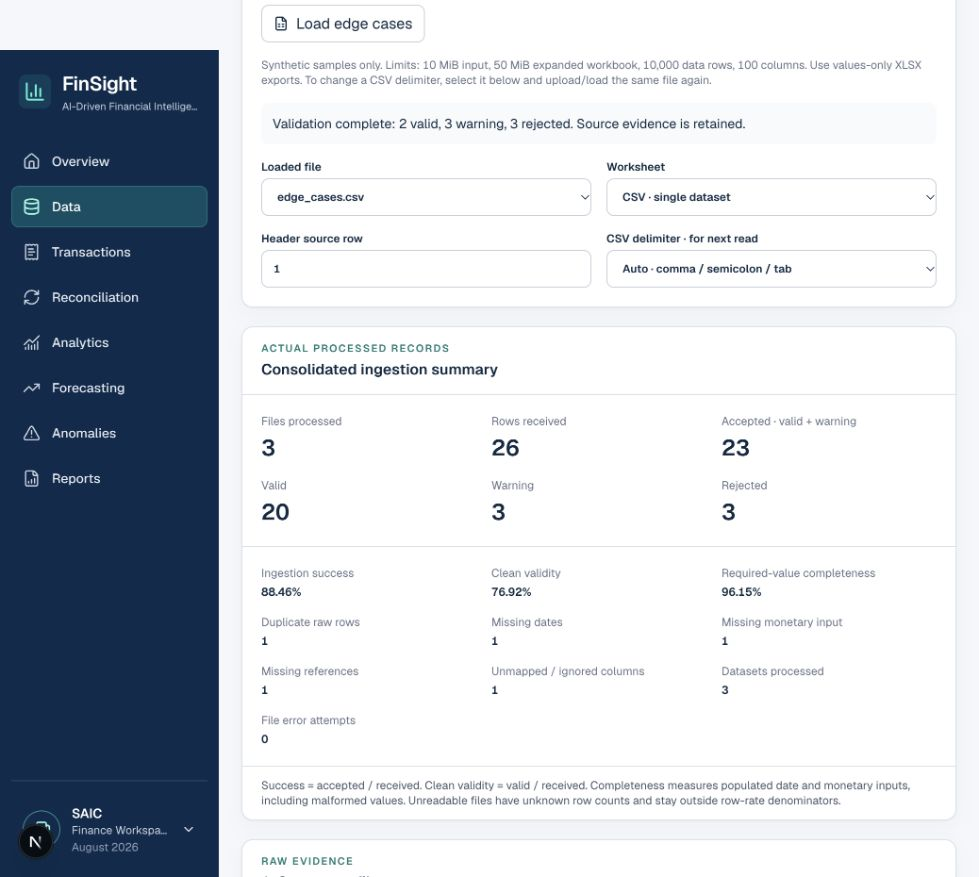
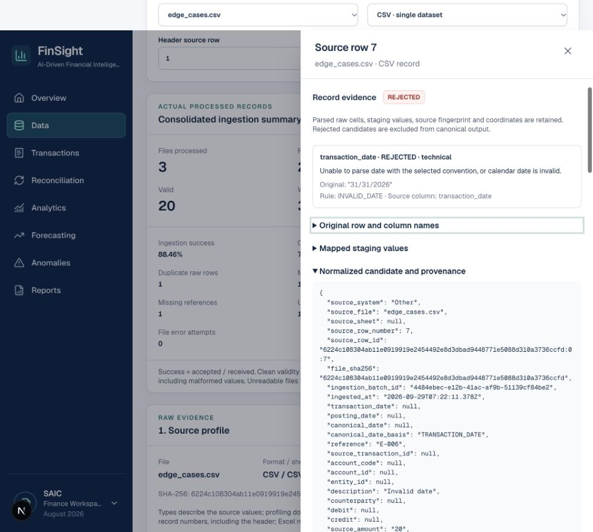

# Supervisor/client consultation demo

Use synthetic data. Open `/data` after following the root README. This page implements ingestion; other navigation pages still show mocks. The schema/rules are version 0.1 and provisional.

## Five-minute walkthrough

| Step | Action | Visible evidence |
| --- | --- | --- |
| 1 | Upload `ledger.csv` or click Load ledger CSV | 10 rows, 7 columns, posting dates/journal references/debit/credit, source fingerprint, raw preview |
| 2 | Review mappings and ledger conventions; keep Canonical date source = Posting date; approve; Validate and normalize | 10 VALID; transaction date null, posting/canonical dates retained, basis POSTING_DATE; debit/credit retained |
| 3 | Upload/load `bank_statement.xlsx` | 2 worksheet choices; neither automatically ingested |
| 4 | Select Transactions | 8 rows, 7 different column names; typed Excel date/number evidence; duplicate description-target warning |
| 5 | Change Map Details to reference | Manual provenance, null score; Narration remains description; conflict clears |
| 6 | Review unsigned amount + Debit/Credit direction; approve and run | 8 VALID; positive source amount and explicit side retained |
| 7 | Load edge cases, leave Unmapped Note ignored, approve and run | 2 VALID, 3 WARNING, 3 REJECTED; unknown column still retained raw |
| 8 | Select REJECTED · 3, inspect row 7 | Original invalid date, field/rule/severity/message, raw/staging/candidate and source coordinates/hash/batch |
| 9 | Close drawer; inspect consolidated output/source links | 23 accepted rows with canonical date/basis and independent transaction/posting dates, separate monetary fields, source and status; pagination 20 per page |
| 10 | Show summary, export evidence, reload ledger, edit a mapping | Exact counts/rates; duplicate file warning; edits invalidate output/approval until rerun |

Expected fixture outcomes were specified independently in `public/samples/ingestion/expected.json` and verified by tests:

| Dataset | Received | Valid | Warning | Rejected | Accepted |
| --- | ---: | ---: | ---: | ---: | ---: |
| Ledger CSV | 10 | 10 | 0 | 0 | 10 |
| Bank Transactions XLSX | 8 | 8 | 0 | 0 | 8 |
| Edge-case CSV | 8 | 2 | 3 | 3 | 5 |
| **Consolidated** | **26** | **20** | **3** | **3** | **23** |

Success **88.46%**, clean validity **76.92%**, required-value completeness **96.15%**. One duplicate raw row, one missing date, one missing monetary input, one missing reference, and one ignored column. Invalid-but-populated date/amount values count as complete, not valid. No metric is labelled accuracy.

Edge rows: source row 4 repeats row 2, row 5 lacks reference, row 6 has malformed currency `MYRR` (warnings); row 7 has `31/31/2026`, row 8 has amount `twelve`, row 9 lacks both date/amount (rejections). These source rows include the header; they are not zero-based dataframe indices.

## Exports and session behavior

- **Canonical CSV**: one line per accepted record, independent transaction/posting dates, explicit canonical date/basis, UTC ingestion timestamp, currency basis, approved zero-conversion records, source provenance, status and messages. Spreadsheet-formula-like text is escaped; no rounded monetary values.
- **Rejected issues CSV**: one line per issue on a rejected record. The edge fixture has 3 rejected records but 4 rejection issues (row 9 has two). Contains original field value, rule and raw record.
- **JSON evidence bundle**: schema/ruleset versions, summary, selected datasets, fingerprint, sheet/header/separator, mappings/approval, conventions, full raw/staging/partial candidates, classifications and canonical rows. Prefer this for exact decimal/identifier consumption.

Refresh/navigation/reset discards session state; download before leaving. Duplicate protection exists only in the current session. Reprocessing replaces the same file/sheet's result. A CSV separator change requires re-reading via upload or the same sample button. Reset clears files, outputs and error attempts. No original binary download is offered because original buffers are released after parsing.

The date source is an explicit processing choice; both source dates retain their meanings. Only the selected date is required; missing/invalid selected input rejects without fallback. The canonical table shows all three dates and the selected basis. The inspector also shows `currency_basis` and any approved blank-side `transformations`; the supplied happy-path fixtures do not require defaults or zero conversions. Required-value completeness counts presence, including malformed values, and must not be described as accuracy.

## Supplied larger synthetic workbook

The supplied course workbook can be uploaded without copying it into Git. Choose **Transactions**, review each suggested mapping and intentionally ignore labels/auxiliary columns, then confirm **Unsigned amount + Debit/Credit direction**. Its 6,000 positive amounts contain 4,148 Debit and 1,852 Credit directions. Never load README, GroundTruth or summary/label sheets as transaction data, or present their labels as measured reconciliation/model accuracy. The optional automated integration check verifies this source separately from the three public consultation fixtures.

## Captured demo views

Screenshots contain only committed synthetic fixtures. Batch IDs and timestamps are generated for the run, so they differ on rerun.

## Questions to use during consultation

1. Which actual source/export and file format should be prioritized?
2. Which date (transaction/posting/value date), identifier and account fields are mandatory downstream?
3. How do sources encode debit/credit, adjustments/reversals, signed amounts and direction?
4. Are both ledger sides permitted on one row, and should exceptions warn or reject?
5. Which date/number locales and currencies/defaults are expected? Is currency mandatory?
6. Which warnings may downstream reconciliation consume, and should uncertain mappings always require approval?
7. What source retention/traceability is required, and is parsed evidence sufficient or must original files be retained?
8. What is the team's versioned canonical handoff and will later ingestion be file-based, API-based or both?

Record actual client/supervisor answers separately. This guide does not imply the consultation occurred or the schema was approved.
