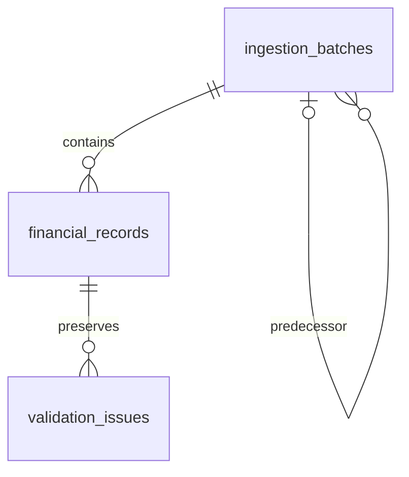

# Phase 1 — ingestion database foundation

## Canonical clean-schema column order

The clean SQL defines `source_file` directly as column 2 on all three tables:

- `ingestion_batches`: `id`, `source_file`, `ingestion_batch_id`, `schema_version`, `ruleset_version`, `status`, then the remaining foundation columns.
- `financial_records`: `id`, `source_file`, `batch_id`, `ingestion_batch_id`, then the remaining financial/lineage columns.
- `validation_issues`: `id`, `source_file`, `financial_record_id`, `issue_ordinal`, then the remaining evidence columns.

The existing-database additive upgrade remains unchanged and cannot reorder PostgreSQL columns. Clean and upgraded schemas retain equivalent behavior, but their physical order differs; verification compares named-column semantics while separately checking clean order. Original baseline fingerprints remain unchanged.

No existing-database reorder script is supplied. Rebuilding established tables solely for physical order risks existing data, object identities, dependent objects and privileges. Use explicit SELECT column lists when order matters. Hosted FYP A may contain data: it was not inspected or modified here, and its physical order is not claimed to have changed.


## Operational database workflow: Supabase SQL Editor only

Hosted FYP A may contain rows following separately performed source-file upgrade and Phase 2 processing. No hosted state was reverified here. Neither script was executed against hosted FYP A during this repository change.

1. Open Supabase Dashboard.
2. Select the correct project: FYP A.
3. Open SQL Editor.
4. Click New query.
5. Paste the complete appropriate SQL script from the table below.
6. Click Run only after separate hosted execution approval.
7. Verify `ingestion_batches`, `financial_records` and `validation_issues` in Table Editor.
8. Run the read-only metadata verification documented in the Phase 1 demo.

| Database state | SQL to paste |
| --- | --- |
| Empty database with no Phase 1 tables | `supabase/sql/phase1-clean-setup.sql` |
| Existing original Phase 1 tables, with or without rows | `supabase/sql/phase1-source-file-upgrade.sql` |

The clean script contains the complete current schema in one transaction, without seed/demo data. Never run it over existing Phase 1 tables. The upgrade adds only the missing source-file support and protections; it preserves existing schema/data and performs no fabricated backfill. It is a one-time upgrade: check the schema before applying it again. Do not run either script in fragments.

Operational SQL is version-controlled under `supabase/sql/`, but hosted execution is exclusively through SQL Editor. No migration CLI, VS Code SQL execution or terminal schema setup is part of this workflow. The original schema under `supabase/tests/fixtures/phase1-original-schema.sql` is immutable local test/history evidence, **never a setup method**. The unchanged synthetic seed is used by local verification, not included in either operational script.

Current schema: 3 tables, 58 columns, 11 indexes, 5 application triggers, RLS enabled, no client policies, client table privileges denied. `source_file` is present directly in all three tables; the existing record column remains NOT NULL while new batch/issue columns allow unknown historical provenance as NULL.

Local automated verification is separate from operational setup:

```powershell
node supabase/tests/verify-local.mjs
node supabase/tests/verify-upgraded.mjs
node tests/persistence/schema-compatibility.mjs
```

The original-baseline verifier uses only the internal fixture. Current integration uses clean SQL; upgraded-schema verification uses the original fixture plus operational upgrade and compares it with clean SQL. All databases are disposable/local and no hosted configuration is loaded.

Status: **complete for the Phase 1 foundation scope**. Reviewed and locally reverified on 5 October 2026. Implementation commit: `78721447cbece18720d7cc2cf17558d693f47557`. The completed backend workspace is integrated into `main` at `75189c20dd91b6c4ce11f6806291739a4df394a0` (same source tree as cleanup commit `d812996`).

This README describes the completed original Phase 1 database foundation. No hosted database was accessed for this documentation task.

## 1. Phase objective

Establish PostgreSQL storage for Chia's accepted canonical ingestion output, preserving exact financial values, source lineage and warning evidence. Create an independently verifiable database foundation before adding the application writer. Schema/ruleset compatibility is explicitly `0.1`; the foundation does not decide accounting conventions, economic identity or production authorization.

## 2. Implemented features

- Three application tables: `ingestion_batches`, `financial_records`, `validation_issues`.
- Database-generated UUID identities, parent/child relationships and ordered warning evidence.
- Exact unrestricted NUMERIC monetary values, text identifiers, separate source dates and an explicit canonical-date basis.
- Checks for accepted status, monetary representation, lineage shape, JSON evidence and count conservation.
- Deferred status/issue consistency checks, supporting atomic parent-and-issue insertion.
- RLS enabled with no client policies, explicit privilege revocation, and lookup indexes.
- Synthetic repeatable seed, SQL positive/negative assertions and a disposable local PostgreSQL verifier.

The existing foundation record documents deployment and verification in personal Supabase project **FYP A** on 3 October 2026. That is a historical verification record, not a newly confirmed hosted state.

## 3. Architecture and design



The operational clean-schema SQL defines the current foundation. Each table owns a UUID primary key generated by `gen_random_uuid()`. Producer `ingestion_batch_id` is preserved as text and is deliberately nonunique across attempts. A composite batch key prevents a financial record from being attached to a different producer context. Source row IDs describe file/sheet/row lineage; they are neither database identity nor economic deduplication keys.

The schema preserves source meaning instead of imposing a universal cash-flow interpretation. Five nullable monetary columns use unrestricted NUMERIC to avoid arbitrary rounding: `debit`, `credit`, `source_amount`, `derived_ledger_net`, `balance`. Original evidence remains JSON where supplied; NUMERIC preserves numeric value, not original formatting. Version context resides on the batch.

Phase 1 provides storage invariants, not a service or transport. [Phase 2](../phase-2/README.md) supplies validation, mapping and the single-connection transactional writer.

## 4. Important files

| File or folder | Purpose |
| --- | --- |
| [Original test/history fixture](../../../supabase/tests/fixtures/phase1-original-schema.sql) | Immutable original baseline for local verification only; not a setup script |
| [Synthetic seed](../../../supabase/seed.sql) | One batch, two accepted records (VALID/WARNING), one issue; fixed synthetic UUIDs and `ON CONFLICT (id) DO NOTHING` for repeat execution |
| [Verification SQL](../../../supabase/tests/verify_ingestion_foundation.sql) | Assertions and rolled-back negative cases for the exact schema |
| [Local verifier](../../../supabase/tests/verify-local.mjs) | Fresh PGlite database, simulated client roles, repeat seed, SQL checks and 23 producer fixture records |
| [Verifier fixture](../../handoff/examples/ingestion-evidence.json) | Synthetic schema/ruleset `0.1` producer evidence used by the local verifier; retained despite frontend/reference cleanup |
| [Supabase ignore rules](../../../supabase/.gitignore) | Exclude `.verification-runtime/` and `.temp/` from source tracking |
| [Ingestion models](../../../lib/ingestion/models.ts), [normalizer](../../../lib/ingestion/normalizer.ts) | Producer contract and exact date/decimal semantics consumed by later persistence |
| [Foundation record](../../database/initial-ingestion-foundation.md) | Detailed mapping, historical local/hosted checks and unresolved decisions |
| [Phase 2 integration tests](../../../tests/persistence/repository.integration.test.ts) | Later regression coverage exercising the current operational clean SQL with the actual pg wire adapter |

`package.json`, `pnpm-lock.yaml`, TypeScript, Vitest and standalone ESLint configuration support the current backend workspace. The Phase 1 verifier specifically uses its separate ignored PGlite runtime; it does not import the newer root development dependency.

## 5. Database changes

**`public.ingestion_batches`:** producer ID; versions restricted to `0.1`; `PROCESSING` default with allowed `ACTIVE`, `SUPERSEDED`, `FAILED`; timestamps; nonnegative received/valid/warning/rejected counts whose sum must balance; object-valued context; optional predecessor UUID. Direct self-reference is forbidden. Completion time cannot precede creation time. `(id, ingestion_batch_id)` is unique.

**`public.financial_records`:** `(batch_id, ingestion_batch_id)` references the composite parent key. Only VALID/WARNING rows are allowed. Source transaction/posting dates are independently nullable; required canonical date must equal its selected existing source date. Ledger mode requires exact `derived_ledger_net = debit - credit`; other source amount modes require source amount and no derived net. Direction mode requires nonnegative magnitude and DEBIT/CREDIT. All monetary columns reject NaN/infinities. Currency and origin are present together; no ISO-currency membership lookup is imposed. Transformations must be a JSON array. Row number is positive; SHA-256 is 64 lowercase hex characters. Producer instant and database creation time are distinct.

**`public.validation_issues`:** record UUID foreign key; nonnegative ordinal unique per record; technical/business category; WARNING severity only; rule/field/message/source column; non-SQL-null JSON original value. Allowed original representations are string, boolean, JSON null, or an Excel date/number object with string value. The database shape check is less exhaustive than Phase 2's runtime object validation.

Foreign keys use `ON DELETE RESTRICT`. There is no cascade-based retention policy. REJECTED records/issues never enter these accepted tables.

`check_record_warning_consistency()` is a PL/pgSQL trigger function with fixed `search_path = pg_catalog, public`. Two `DEFERRABLE INITIALLY DEFERRED` constraint triggers check that VALID has zero issues and WARNING has at least one issue. Issue movement also checks that the old WARNING parent retains issues. Invalid transaction completion raises SQLSTATE `23514`.

There are **11 indexes**: three primary keys, two composite unique indexes, producer-batch lookup, batch-record lookup, hash/sheet/row lineage, source-row lookup, canonical-date lookup, and partial source-system/transaction-ID lookup. Their counts by table are 3 batches, 6 records, 2 issues.

RLS is enabled on all three tables; the Phase 1 migration creates **zero policies** and revokes table privileges and warning-function execution from PUBLIC, anon and authenticated. It does not enable FORCE RLS or create production application roles.

## 6. API and backend behaviour

Phase 1 introduced **no HTTP endpoints, server actions, public read/write API, authentication service or application database adapter**. Callers at this stage are SQL Editor setup/update SQL, local verification SQL and later trusted server writers.

SQL CHECK/FK/unique/deferred-trigger violations reject invalid storage. Operational SQL is enclosed in a transaction. Parent/accepted rows/issues must be written atomically to satisfy deferred checks. Batch counts are reported values, not automatically maintained totals. The schema alone permits ACTIVE without proving accepted-row completeness; Phase 2 strengthens the writer's completion checks.

The synthetic seed is not production data or a lifecycle workflow. Its repeatability does not provide ingestion request idempotency.

## 7. Security considerations

Client privileges and RLS deny ordinary anonymous/authenticated table access. Owners and BYPASSRLS roles can bypass row policies; this foundation is not authentication, tenancy or production authorization. It adds no broad client grants and no browser credentials.

Store secrets only in approved server environments. `.env*`, generated runtime/cache and related local files remain ignored. Do not expose connection URLs, passwords, tokens or real financial content in Git/logs. SQL constraints establish storage consistency, not authorized source ownership or accounting correctness.

The original deployment used SQL Editor; SQL Editor remains the only operational setup/update workflow. Automated verification uses disposable local databases.

## 8. Tests and verification

Confirmed on **5 October 2026**:

- `node supabase/tests/verify-local.mjs`: all checks passed, including fresh migration, seed twice, rolled-back negative assertions, exact money/identifiers/dates, UUID relationships, RLS/client denial, all 23 accepted producer fixture records with ordered issues, and 11 indexes.
- `node tests/persistence/schema-compatibility.mjs`: original migration baseline reports 3 tables, 56 columns, 11 indexes, 2 application constraint triggers, RLS enabled, zero policies and client table privileges denied.

Reproducible commands from the repository root:

```sh
node supabase/tests/verify-local.mjs
node tests/persistence/schema-compatibility.mjs
pnpm test:db
pnpm typecheck
pnpm lint
pnpm check:server-boundary
pnpm test
```

If the separate Phase 1 runtime is missing, the documented local-only setup is:

```sh
npm install --prefix supabase/.verification-runtime --no-save --package-lock=false --cache supabase/.verification-runtime/npm-cache @electric-sql/pglite@0.3.14
```

This creates ignored development artifacts, not source or hosted data. Do not run seed or mutation-verification SQL against real production data. Local verification simulates Supabase roles; it does not verify hosted authentication, network/TLS, deployment performance or concurrent writers.

## 9. Integration dependencies

Depend on the producer's explicit schema/ruleset `0.1`, accepted canonical records and warning/provenance structures. Later services must preserve exact decimal strings at the application boundary, leading-zero identifiers, independent dates/basis, transformations, source lineage and issue ordering. They must obtain database UUIDs and retain producer IDs separately.

Do not use source hashes/row IDs/producer IDs as economic or durable request uniqueness. Preserve the immutable original fixture and verify the current clean/update SQL independently. Phase 2 depends on the three-table names, column shapes, foreign keys and deferred trigger semantics.

## 10. Known limitations

No durable request registry, economic deduplication, rejected/raw/binary evidence storage, retention deletion workflow, active-batch uniqueness, automatic superseding or complete lifecycle engine. Longer predecessor cycles are not prevented. Counts are not database-maintained; ACTIVE is not an accounting/reporting guarantee.

Deferred checks assume an agreed serialized mutation protocol; they do not by themselves establish general concurrent update safety. Authentication, organizations, production writer privileges, read APIs, browser integration and deployment configuration were outside Phase 1.

Historical foundation docs reference removed frontend/example/test paths and Next verification commands. The current backend workspace no longer runs Next. Historical hosted verification is retained as evidence, but was not repeated here; current hosted state is not asserted.

## 11. Phase completion state

The foundation is complete when the original schema fixture applies to a fresh compatible PostgreSQL environment, the synthetic seed can be repeated, storage/relationship/deferred-warning/precision/lineage/negative/RLS assertions pass, and the schema/limits are documented. These conditions pass in the local verifier. The existing record also documents the earlier authorized hosted deployment.

Completion is limited to this database foundation; it does not imply production readiness, secure public APIs, final privileges or a completed application writer. Source/migration/seed were not modified in creating this README.

## 12. Handoff to the next phase

Build validation, allowlisted mapping and transactional persistence on the existing schema; do not rebuild the ingestion engine or infer financial rules from mock frontend types. [Phase 2](../phase-2/README.md) implements that writer and is the next handoff reference.

Any later schema/version change needs its own reviewed SQL Editor upgrade script and preservation tests. Keep accepted status, UUID relationships, exact numeric semantics, canonical source-date equality and ordered warning evidence intact. Resolve authorization, retry identity, retention and reporting population explicitly before exposing privileged storage.
