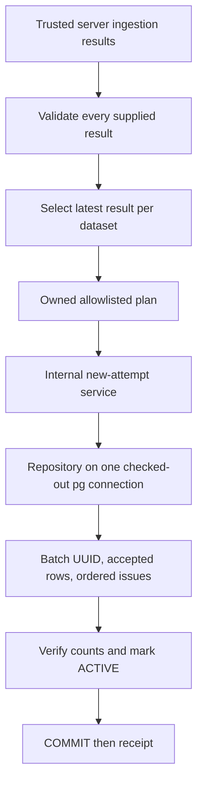

# Phase 2 — internal transactional ingestion persistence

Database schema provisioning is performed only through Supabase SQL Editor. Use `supabase/sql/phase1-clean-setup.sql` for an empty database, or `supabase/sql/phase1-source-file-upgrade.sql` for existing original Phase 1 tables. Hosted FYP A has not received the source-file upgrade; do not run the updated writer there until separately authorized and verified. Original schema fixtures are internal local test/history artifacts, never operational setup instructions.

## Source filename provenance update (local verification only)

The prepared schema upgrade has **not been deployed to hosted FYP A**. Hosted execution requires separate approval and schema verification. Do not run the updated writer against the old hosted schema.

Use `source_file` consistently: it is new on `ingestion_batches` and `validation_issues`, and remains the existing column on `financial_records`. No `source_file_name` column is introduced. New persistence attempts use one validated basename across the three tables. Historical new columns remain NULL; existing record provenance is preserved verbatim. No historical filenames are fabricated.

## Filename flow and compatibility

The developer command remains:

```powershell
corepack pnpm phase2:ingest tests/phase2_financial_input.csv
```

It derives `phase2_financial_input.csv` automatically. No second filename argument is required. Do not run this command against the existing hosted configuration until deployment and ingestion are separately authorized.

```text
physical file -> validated basename -> Chia file metadata
-> persistence request.source_file -> validated plan.batch.source_file
-> ingestion_batches.source_file
-> existing financial_records.source_file
-> validation_issues.source_file
```

The CLI supplies `source_file` explicitly. Retained internal `{ results }` callers can omit it: preflight derives one authoritative value from verified producer file metadata. An explicit value must match every result, including results later consolidated. Different filenames in one attempt are rejected; multiple sheets of one file remain supported. This metadata is provenance, not durable request identity.

Filename validation requires a nonblank string of at most 255 Unicode characters, with no path separators or control characters, excluding `.` and `..`. Useful spelling and Unicode are retained. Paths are never persisted as filenames. Chia already trims/sanitizes and shortens names over 160 characters; the CLI fails safely if Chia changes the physical basename instead of silently storing a different filename. Chia remains unchanged.

The repository binds the single name as SQL parameters. It verifies each record name agrees with the batch before writing and assigns each issue the batch name. Database triggers enforce matching names for named batches, lock parents during child checks, and prevent changing a batch name after records exist. Legacy NULL batch/issue names remain allowed; a non-NULL legacy issue name must match its record. Historical NULLs are not silently backfilled. Financial record names remain NOT NULL as before.

Accepted VALID/WARNING records and ordered warning evidence retain the existing behavior. REJECTED rows contribute counts but are excluded from accepted storage. Transaction/count/ACTIVE/commit-before-receipt, rollback and uncertain-COMMIT handling are unchanged. No automatic retry, security phase or lifecycle feature is added.

Run the local integration test to exercise the real physical CSV, Chia, service, repository and pg adapter using disposable loopback PostgreSQL:

```powershell
corepack pnpm exec vitest run tests/persistence/repository.integration.test.ts
corepack pnpm exec vitest run tests/persistence/cli.test.ts
```

These tests do not load developer `.env.local`. Missing-configuration subprocess tests retain the explicit test-only environment-loader disable switch and an allowlisted environment. Normal developer invocation still intentionally loads `.env.local`, so it is not a safe substitute for the local tests here.

Status: **complete for the Phase 2A/2B/2C internal-writer scope**. Reviewed and locally reverified on 5 October 2026. Phase 2A commit: `b2291473dfeccdbf07a875f889736fa206043904`; Phase 2B/2C commit: `ebacdee0f80f7e4a8a718db2536a91dbe2009e12`. Backend-only cleanup: `d812996`; integration into personal `main`: `75189c20dd91b6c4ce11f6806291739a4df394a0`.

This describes the completed Phase 2 implementation, supported by source, original commit versions, tests and existing records. The internal writer has no application authentication, membership or organization-scoping service.

## 1. Phase objective

Convert trusted server-produced Chia ingestion results into validated owned persistence plans, then atomically write accepted canonical records and ordered warning evidence to the existing PostgreSQL foundation. Remain internal and server-only; do not create public/browser persistence or invent unresolved identity, accounting, tenancy or reprocessing policies.

## 2. Implemented features

- **2A:** pinned contract/version checks, input consistency validation, all-result preflight, latest-same-dataset consolidation and owned allowlisted mapping.
- **2B:** server-only pg configuration/pool/transaction adapter and parameterized three-table repository.
- **2C:** explicit new-attempt orchestration, preflight before storage, committed receipt and sanitized failures.
- Exact financial text, independent dates, leading-zero identifiers, transformations, lineage, warning originals and issue order preserved end-to-end.
- Count/completion checks, real rollback/deferred-constraint tests and conservative unknown-commit handling without retries.
- Local actual PostgreSQL wire integration and historical read-only hosted metadata compatibility verification.

## 3. Architecture and design



The service invokes validation/mapping before repository transaction work; the diagram shows the data stages rather than separate callable HTTP steps. Pure Phase 2A helpers have no database resources. The adapter, repository and service import `server-only`. Factories permit injected database/repository abstractions in unit tests; local integration uses the actual pg adapter, not a mock database.

Database identities are obtained with `RETURNING id`. The prepared plan contains no invented UUID/FK; nested issues stay attached to their canonical row until the repository receives its database UUID. No ORM was introduced. SQL identifiers are fixed constants; financial/source/request values are parameters.

The default factory creates a service plus `close()`. The caller owns lifecycle, should reuse its pool and close it at shutdown; there is no automatic per-request lifecycle or deployed worker supplied by this phase.

## 4. Important files

| File or folder | Purpose |
| --- | --- |
| [contracts.ts](../../../lib/server/persistence/contracts.ts) | Independently pinned `0.1` compatibility, request/plan/receipt types and fixed safe errors |
| [validate.ts](../../../lib/server/persistence/validate.ts) | Pure consistency, shape, values, accepted evidence, version and producer-context preflight |
| [map.ts](../../../lib/server/persistence/map.ts) | Owned allowlist projection, batch counts, transformations and ordered issue mapping |
| [postgres.ts](../../../lib/server/db/postgres.ts) | Server environment/TLS/pool config, exact parsers, one-client transactions, safe failures and cleanup |
| [repository.ts](../../../lib/server/persistence/repository.ts) | Parameterized inserts, UUID attachment, counts and successful lifecycle completion |
| [service.ts](../../../lib/server/persistence/service.ts) | New-attempt-only intent, synchronous preflight before awaited storage, receipt/errors and lifecycle factory |
| [tests/persistence](../../../tests/persistence/) | Six test files plus producer fixtures; 2A, unit, actual PostgreSQL integration and metadata tools |
| [Schema baseline tool](../../../tests/persistence/schema-compatibility.mjs), [metadata SQL](../../../tests/persistence/verify-hosted-compatibility.sql) | Apply only the original migration locally and compare catalog/RLS/grant fingerprints without financial row reads |
| [lib/ingestion](../../../lib/ingestion/), [tests/ingestion](../../../tests/ingestion/), [fixtures](../../../public/samples/ingestion/) | Unchanged producer contract/engine, compatibility coverage and synthetic inputs |
| [package.json](../../../package.json), [lockfile](../../../pnpm-lock.yaml), [tsconfig](../../../tsconfig.json), [Vitest](../../../vitest.config.mts), [ESLint](../../../eslint.config.mjs) | Backend dependency resolution, scripts, strict checking and test/lint discovery |
| [Boundary checker](../../../scripts/verify-server-boundary.mjs) | Actual marker conditional-export check; checks the retained Phase 2 server modules |
| [Implementation record](../../database/phase-2-internal-persistence.md), [design](../../database/phase-2-persistence-design.md), [cleanup record](../../database/workspace-cleanup-review.md) | Detailed decisions, historical results and transition to a backend-only workspace |

Runtime additions were `pg` 8.23.1 and `server-only` 0.0.1; local test tooling includes PGlite 0.5.8, PGlite socket 0.2.11 and pg types. Parser dependencies remain Papa Parse, read-excel-file and fflate. The standalone Phase 1 verifier uses its separate pinned PGlite 0.3.14 runtime; these are deliberately different test tools.

## 5. Database changes

**Phase 2 introduced no migration, table, constraint, index, function, trigger, RLS policy or grant change.** It consumes the Phase 1 database foundation; its original shape is retained as an [internal test fixture](../../../supabase/tests/fixtures/phase1-original-schema.sql).

The repository inserts the default PROCESSING parent, financial records, then warning issues. It verifies actual accepted/valid/warning/issue counts against the prepared plan and count conservation before updating `status = ACTIVE` and `completed_at`. ACTIVE certifies a completed nonempty accepted write through this writer, not accounting validity, uniqueness, analytics eligibility or a final reporting population. No history is deleted or automatically superseded; no predecessor link is created by Phase 2.

Phase 2 uses the original three-table migration; no separate Phase 2 schema migration is required.

## 6. API and backend behaviour

There are **no Phase 2 HTTP endpoints, route handlers, browser server actions or public write/read APIs**. The internal entry point is `createPersistenceService(repository).persistNewAttempt(input)` or the lifecycle factory `createServerPersistenceService()`.

Request shape:

```ts
{
  intent: "NEW_ATTEMPT_NO_RETRY",
  results: trustedEngineResults
}
```

Only own data properties `intent` and `results` are accepted by the service; unsupported intent/extra retry metadata/accessors are rejected. Nonempty results are required. Preflight permits plain JSON-like objects and dense data arrays, rejects invalid dates/timestamps/NUL text, and requires schema/ruleset `0.1` on every supplied result, including those later replaced.

Preflight checks dataset/hash/sheet/row IDs, positive row positions, source/provenance consistency, unique processed row numbers, accepted candidate-to-normalized equality, ordered issues, matching statuses and conserved summary counts. VALID has no issues; WARNING has WARNING issues; REJECTED evidence contributes counts but is not mapped into accepted storage. All results share one producer batch ID. Only after all checks does latest same-dataset selection occur.

Monetary values are string/null, with a strict finite decimal syntax and size limits: 128 characters for source monetary fields, 260 for derived ledger net. Dates must be canonical valid ISO dates; ingestion time must equal normalized UTC instant text. Ledger subtraction is exact through the shared normalizer, not JavaScript Number. Selected canonical date must match its independent source; direction mode requires a nonnegative magnitude and entry side. Approved blank-side-zero transformations must match the target, original blank evidence and producer option. Malformed warned currency or reviewed negative/dual-sided ledger values are not silently reinterpreted.

Issue `sourceColumn`/`originalValue` become `source_column`/`original_value`; zero-based ordinals preserve order. JSON null is serialized as JSON null, not SQL NULL. The owned plan excludes raw/staging/rejected evidence and cannot be changed by later caller mutation.

Transaction flow is BEGIN → local timeouts → inserts → count checks → completion update → COMMIT, all on **one checked-out client**. Pre-commit failures roll back. Definite integrity/transaction-rollback SQLSTATE classes at COMMIT fail without a successful receipt. Ambiguous commit returns `COMMIT_OUTCOME_UNKNOWN`; unconfirmed rollback returns `ROLLBACK_UNCONFIRMED`. An attempted rollback after a lost acknowledgement is not proof that COMMIT did not happen. Broken/uncertain clients are destroyed and released in `finally`; no automatic retries occur.

Receipt only after successful COMMIT: `outcome: PERSISTED_NEW_ATTEMPT`, database `batch_id`, producer `ingestion_batch_id`, accepted-record count and warning-record count (not issue count).

Fixed `PersistenceError` codes cover `INVALID_INPUT`, `UNSUPPORTED_VERSION`, `MIXED_BATCH_IDS`, `DATABASE_CONFIGURATION`, `DATABASE_UNAVAILABLE`, `PERSISTENCE_FAILED`, `COMMIT_OUTCOME_UNKNOWN`, `ROLLBACK_UNCONFIRMED`, `IDEMPOTENCY_UNSUPPORTED` and `EMPTY_ACCEPTED_BATCH_UNSUPPORTED`. No raw SQL error, credential or row contents are returned.

## 7. Security considerations

Phase 2 trusts server-produced engine results, not arbitrary browser claims. Validation is not identity, authorization, source ownership or proof of accounting correctness. Authentication/tenancy were not implemented by this phase. RLS/client denial remains Phase 1's configuration; owners/BYPASSRLS credentials still need a separate trusted application boundary.

The real `server-only` package blocks default imports; trusted standalone Node entry points use `--conditions=react-server`. Existing tests mock the marker only within their harness. React/Next is no longer a workspace dependency. The marker enforces architecture usage, not authentication.

Only server environment configuration supplies `SUPABASE_DATABASE_URL` and optional `SUPABASE_DATABASE_CA_CERT`. No real value is shown or committed. Remote connections use certificate verification; only loopback development can disable TLS. URL fields are parsed explicitly so query options cannot overwrite TLS verification; unknown options are rejected. No global NUMERIC-to-Number parser is installed: per-pool NUMERIC/date/timestamp parsers preserve text. All writes use parameterized values. Runtime code does not log source rows, connection URLs or raw database failures.

Pool maximum is 4; connection timeout 5 seconds; idle timeout 10 seconds; statement timeout 10 seconds; lock timeout 3 seconds; idle transaction timeout 10 seconds; driver query timeout 11 seconds. A 30-second operation deadline is checked between statements and before COMMIT, not a hard cancellation timer; an in-flight statement/commit and cleanup may extend elapsed time.

## 8. Tests and verification

Confirmed on **5 October 2026** against the current checkout (including pre-existing uncommitted security changes):

| Check | Confirmed result |
| --- | --- |
| Phase 2A validation/mapping tests | 83 passed within full run |
| Adapter/repository/service unit tests | 31 passed within full run |
| Actual pg/PostgreSQL integration tests | 17 passed within full run |
| Persistence total | 131 passed |
| Retained ingestion compatibility | 85 passed |
| Full current checkout | 294 passed in 17 files; includes 78 later security tests, not Phase 2 features |
| TypeScript | Passed |
| Lint | Successful exit, zero errors, one existing `no-unsafe-finally` adapter warning |
| Actual server-only conditional imports | Passed |
| Phase 1 verifier and original schema fingerprints | Passed |

The integration suite uses a fresh local PGlite database with the exact Phase 1 migration and simulated anon/authenticated roles. A loopback ephemeral socket carries actual pg wire traffic through the real adapter/service/repository. Real database state proves rollback after parent/record insertion, invalid issue/count writes and deferred COMMIT checks. Tests also simulate lost acknowledgement **after a real COMMIT**: one complete attempt remains, no successful receipt/retry follows.

Other coverage includes precision beyond safe Number range, zero/negative/null values, identifiers, independent dates, transformations, lineage, issue originals/order, rejected exclusion, multiple records, parameterized injection-shaped literals, nonmutation, safe failures and history preservation. Local role-denial tests use only disposable grants rolled back afterward.

```sh
pnpm test:persistence
pnpm test:db
pnpm test:ingestion
pnpm test
pnpm typecheck
pnpm lint
pnpm check:server-boundary
node supabase/tests/verify-local.mjs
node tests/persistence/schema-compatibility.mjs
```

Historical Phase 2 records report 228 passed, one skipped, one CRLF/LF handoff failure. Cleanup deliberately removed the separate recipe suite and optional workbook test, retaining all persistence tests; the later backend-only baseline was 216 passed. Current 294 includes later local security tests. These totals describe different scopes, not a fixed or hidden failure.

Historical hosted compatibility was read-only metadata verification in FYP A: 3 tables, 56 columns, 11 indexes, 2 application constraint triggers, RLS enabled, zero policies/client table grants. Today's local original-migration fingerprints match the recorded baseline. Hosted state, credentialed pg/TLS connectivity and deployed writes were **not rechecked** during this documentation task.

## 9. Integration dependencies

Phase 2 depends on [Phase 1](../phase-1/README.md), Chia's unchanged models/normalizer and full engine dependency closure used by synthetic producer tests. Production helpers directly use models/types and normalizer functions; the tests use the public barrel, which reaches all 12 engine files. Four fixture files remain under `public/samples/ingestion` as test data, not a served frontend.

Later phases must preserve the independently pinned versions, one-producer-ID rule, all-result preflight before replacement, owned plan, exact values, accepted-only storage, warning order, database UUID attachment, commit-before-receipt and conservative uncertain-outcome handling. Neither session IDs nor file/row hashes supply durable request identity.

The persistence repository is an internal trusted writer. Validation does not authorize a public caller.

## 10. Known limitations

- `NEW_ATTEMPT_NO_RETRY` is caller intent, not durable idempotency. Two declared new attempts create separate history. A falsely relabeled old delivery cannot be detected. Do not connect automatic-redelivery queues until durable request identity/replay/conflict and commit reconciliation are approved.
- An all-rejected plan can be prepared, but the writer rejects it before connection checkout with `EMPTY_ACCEPTED_BATCH_UNSUPPORTED`.
- No automatic superseding, economic deduplication, failed-attempt audit row, rejected/raw/file retention, reporting selection policy or general concurrent mutation protocol.
- No Phase 2 authentication, tenancy, public API, browser integration, final writer-role grants or deployment/pooler decision.
- Individual row inserts and bounded timeouts are not a proven production bulk-throughput design. PGlite's single-connection socket does not establish hosted TLS, performance or multi-session equivalence.
- Existing release failure can throw from `finally`, overriding an earlier receipt/error, including an uncertainty code. The lint warning is retained; a future fix requires a reviewed behavioral change, not documentation-driven source edits.
- Earlier implementation docs still say uncommitted/unpushed, include an obsolete `@/` import example, and discuss frontend paths/old test totals. Git proves completion commits exist; TypeScript no longer configures that alias. Use real relative/package imports appropriate to a trusted Node integration, not the historical snippet verbatim.

## 11. Phase completion state

Completed when 2A preflight/mapping, server-only pg adapter, parameterized repository, one-client atomic transactions and internal service are implemented; exact schema/producer contracts are preserved; actual rollback/COMMIT integration and meaningful producer tests pass; TypeScript/lint and scope/security review are recorded. Those requirements passed for the completed commits and current unchanged Phase 2 test suite.

The accepted scope explicitly leaves durable idempotency, empty activation, production credentials/privileges and public integration open. Completion of the internal writer is not a claim of production deployment or safe unauthenticated use. No implementation was changed to produce this README, and later local security work is not declared complete.

## 12. Handoff to the next phase

Next: plan durable requests, technical reconciliation and batch lifecycle without changing the retained ingestion or persistence contracts. Authentication/cybersecurity integration belongs to the separate team security responsibility. Public transport and dashboard-ready data services are a subsequent planned backend phase.

For every future backend phase, create `docs/phases/phase-N/README.md` **after** its required implementation and verification pass. Use the same 12-section structure: objective; implemented features; architecture/design; important files; database changes; API/backend behaviour; security; tests/verification; integration dependencies; limitations; completion state; next-phase handoff. Describe the final verified implementation, identify verification date/scope and preserve the distinction between implemented and planned functionality. Do not mark incomplete or merely locally passing future work complete without its required checks.
